# Opanex manual

The platform is accessible from [https://opanex.discover.ilabt.imec.be/](https://opanex.discover.ilabt.imec.be/).

## Homepage

To login, click the <kbd>`log in`</kbd> button at the top right.

## Login

Log in with Google.

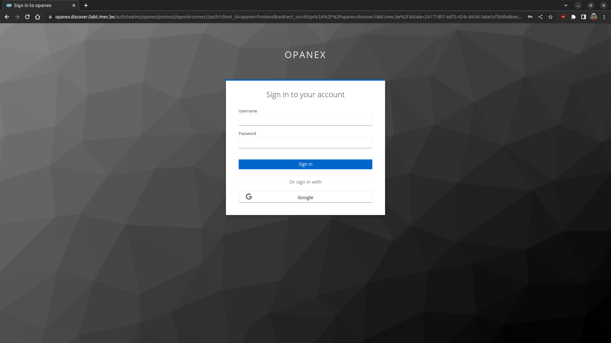

## Homepage when logged in

When logged in, a student can explore a model or start a quiz. A teacher or admin will now also have access to the dashboard at the top right.

## Model dashboard

At the model dashboard, an overview of all the models you own are shown. You can also toggle the switch in the top left to view models of other teachers.

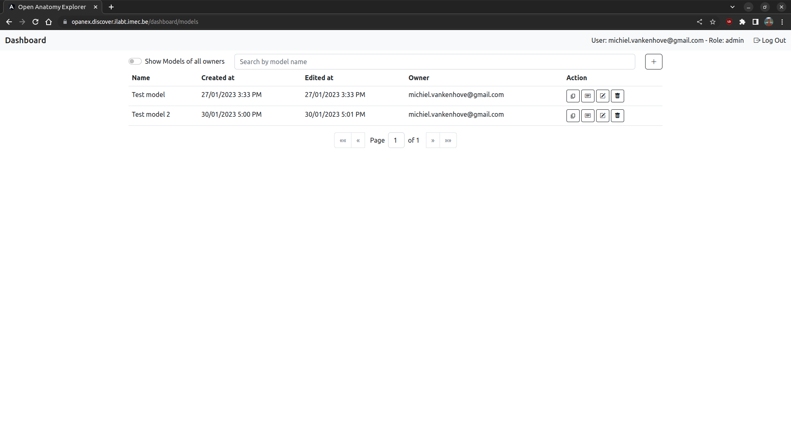

### Model actions

A model you own has a couple of options.

- First option: copy the model ID to clipboard, this model ID can be given to students to explore the model in the 3D-viewer.
- Second option: opens the quizzes dashboard.
- Third option: gives the ability to edit the model (and also add labels to the model).
- Last option: gives the ability to remove the model.

### Create a model

To create a model, press the <kbd>`+`</kbd> button in the top right of the model dashboard.

Give the model a name and a category (the category is mostly ignored at the moment, but is required). When creating the model, you can choose to not add an object file, this gives you the ability to upload the object file later.

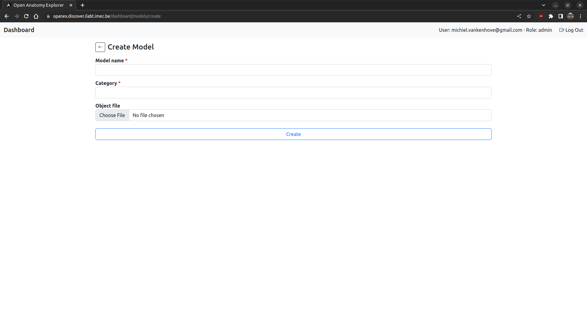

### Edit a model

You can edit the name, category, object file and labels of a model here.

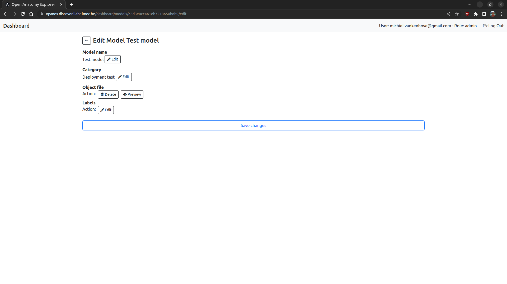

### Add labels to a model

To add or edit labels of a model, go to the edit model screen and click the <kbd>`Edit`</kbd> button under the `Labels` section.

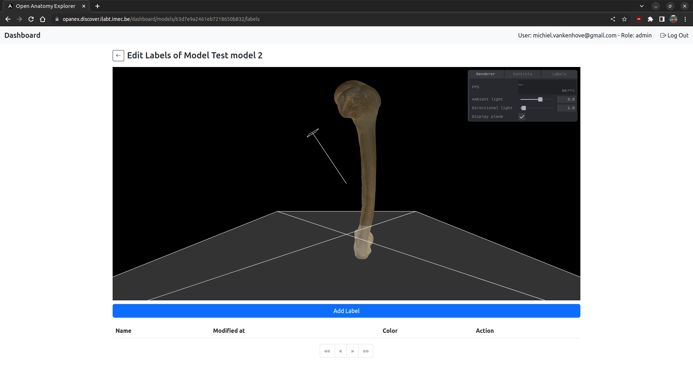

To add a label:
- Click the <kbd>`Add Label`</kbd> button.
  
  
- Give the label a name and use the controls at the top right of the renderer to draw the label on the model.
  
  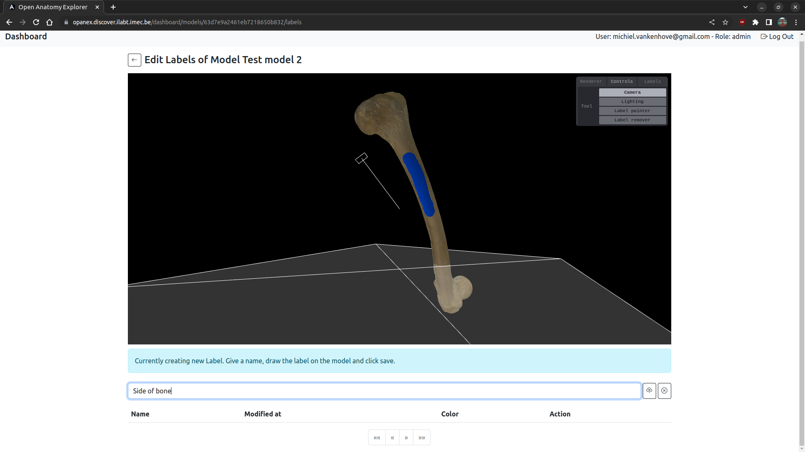
- Click the save button.
  
  
- The label should be saved.
  
   

To edit a label:
- Click the edit button of the label and modify as needed. Don't forget to click save afterwards
  
  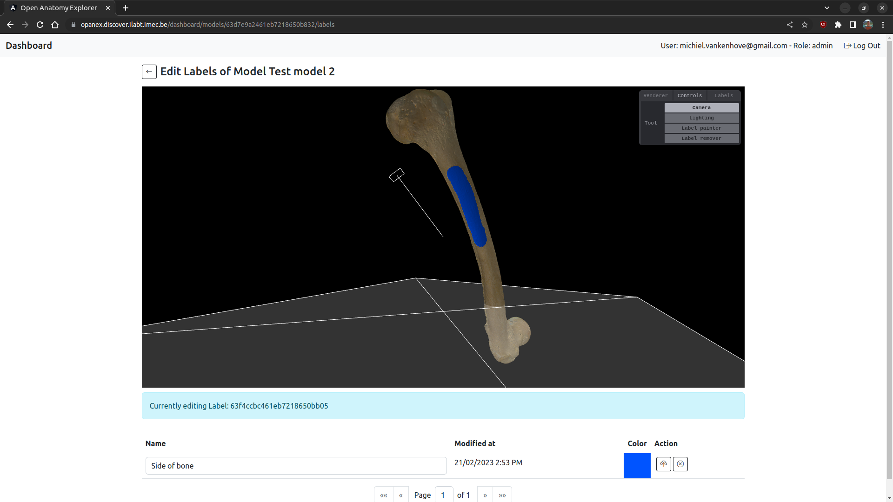

## Quizzes dashboard

Click the quizzes dashboard button of a model. This gives access to the dashboard of the quizzes associated with the model.

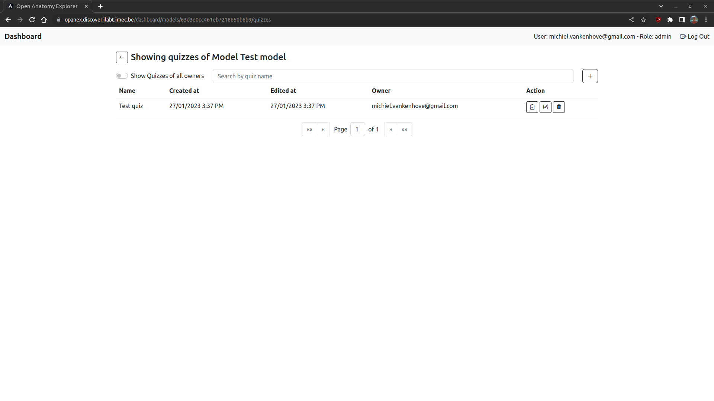

### Quizzes actions

- First option: open quiz instances
- Second option: edit the quiz
- Third option: remove the quiz

### Create quiz

To create a quiz, press the <kbd>`+`</kbd> button in the top right of the quizzes dashboard.

- Give the quiz a name
- Choose if the questions of the quiz should be shuffled for each student
- Add questions
  

Locate question:

Select the label that should be located and formulate a question that specifies what should be located.

Name question:

Select the label that should be displayed and the student should describe. Give the correct answer to the question.

Free-form question:

Open question.

### Edit quiz

Allows you to edit the quiz: add/remove/edit questions.

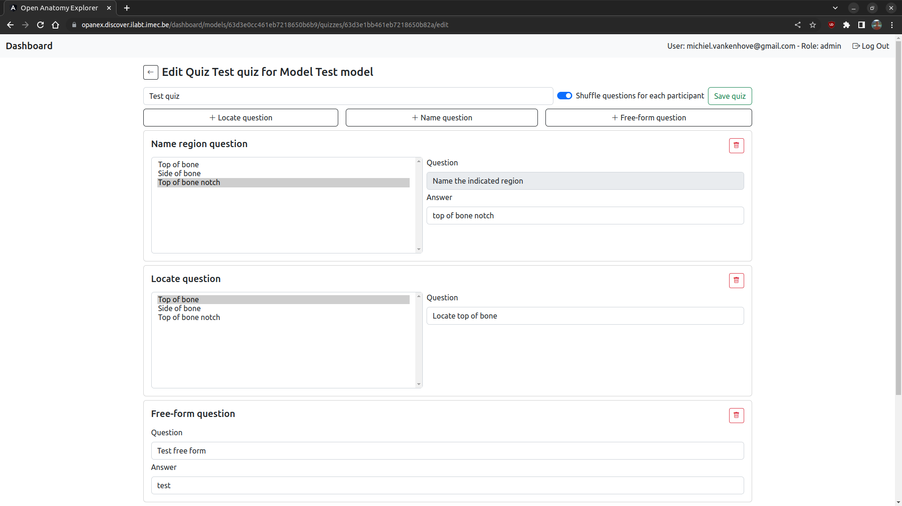

## Quiz instances

Allows you to create a new instance of a quiz and generate an invite code for a quiz. This creates a "snapshot" of the quiz. Editing the quiz after an instance was created will not update the instance.

You can create an instance by pressing the <kbd>`+`</kbd> button in the top right.

### Quiz instance actions

- First option: view submissions of the instance
- Second option: copy the invite code to clipboard
- Third option: remove the instance

## Submissions

Gives an overview of the submissions. You can remove a submission or view its details.

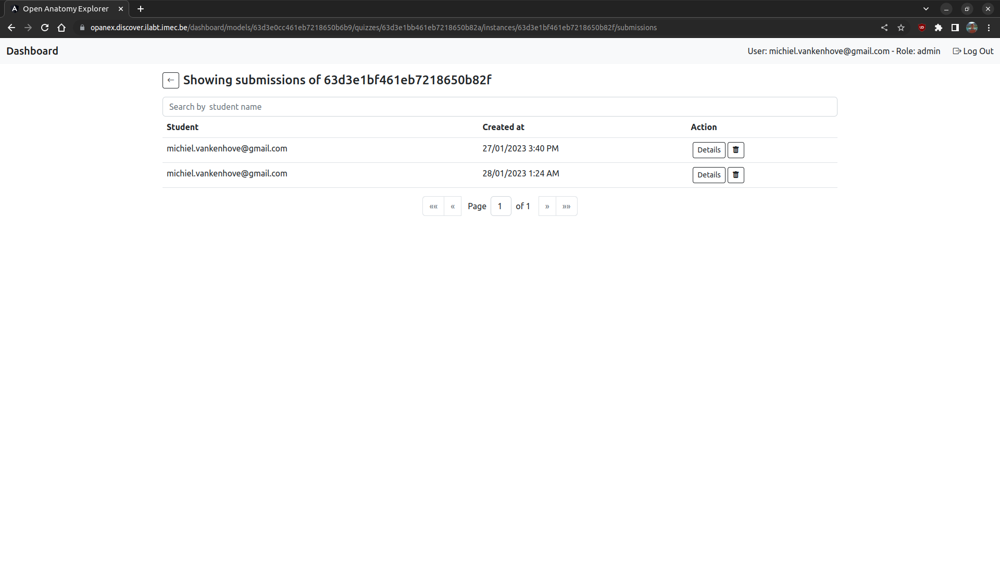

### Submission details

Check the answers.

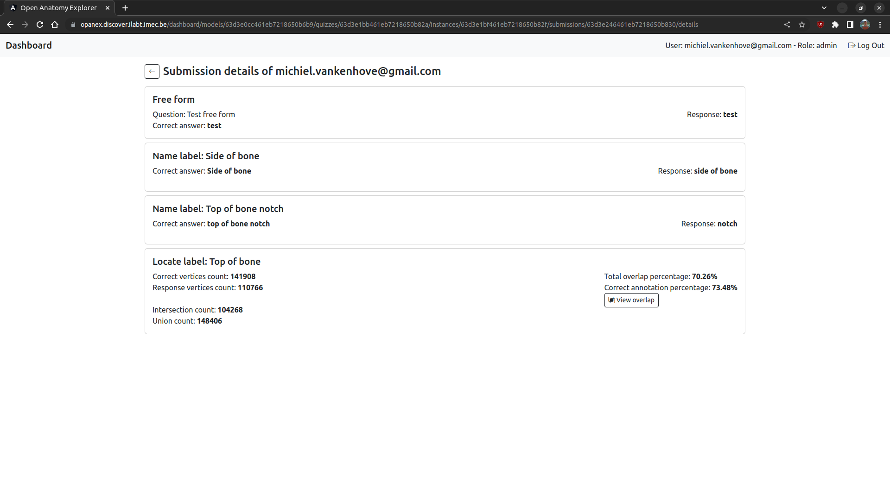

### Overlap

Check the overlap manually.

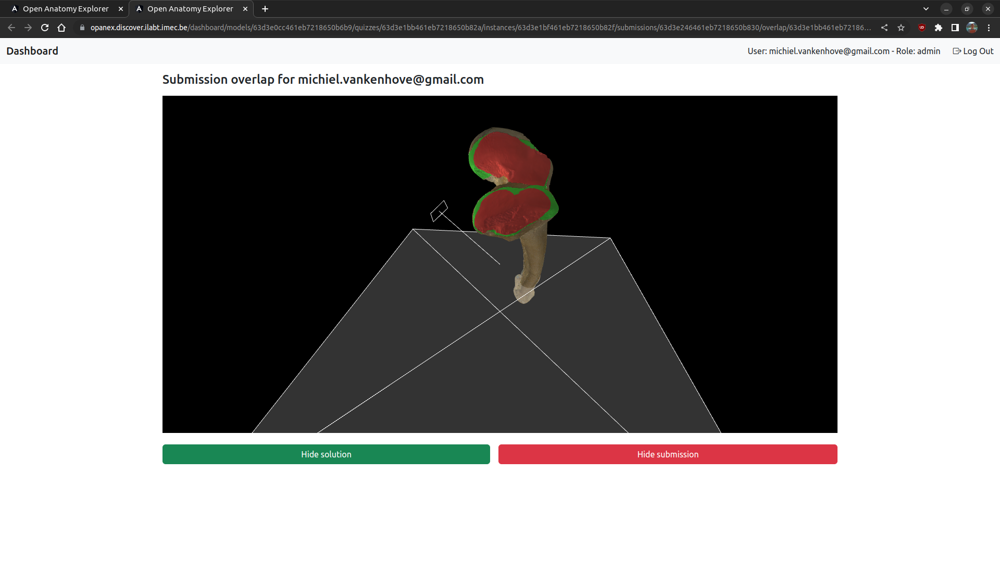

## Start a quiz

To start a quiz, fill in the quiz instance invite code at the homepage.

Press start quiz.

At the end of the quiz, press `Submit`.

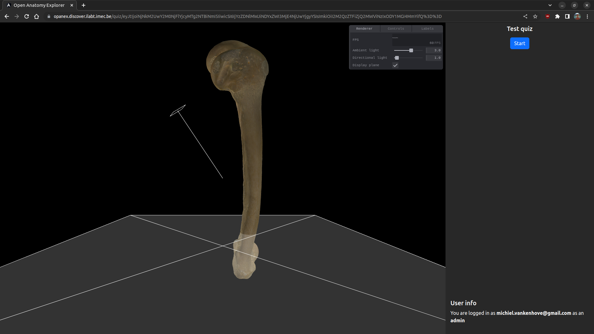

